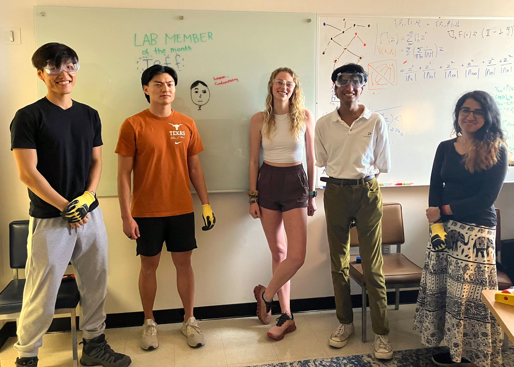

<!-- # The Gilpin Research Group -->
<!-- # Research -->

  

<!-- We are interested in computational nonlinear dynamics, broadly applied.  -->
Our curiosity-driven research group bridges fluid dynamics, statistical learning, and systems biology. We develop new theory and algorithms for analysis and control of chaotic systems---like turbulent bursts, or neural spikes---and collaborate to apply these tools broadly. One part of the lab develops novel machine learning algorithms for time series, drawing upon the classical physics of complex systems like strange attractors, cellular automata, and random graphs. The second part of the group applies these principles to real-world complex systems such as biological measurements and fluid mixing.

**Check out our [visualization gallery](pages/gallery.html)**

# Members

<!--  
 -->

 
William Gilpin, Assistant Professor of Physics\
Department of Physics & Oden Institute for Computational Engineering and Sciences\
The University of Texas at Austin\
[[CV]](http://www.wgilpin.com/CV/wgilpin_CV.pdf) [[Twitter]](https://twitter.com/wgilpin0) [[Web]](http://www.wgilpin.com/?utm_source=labwebsite) [[Email]](mailto:wgilpin@fas.[dravrah%20spelled%20backwards].edu) [[GitHub]](https://github.com/williamgilpin)

Jeff Lai. PhD student in Computational Science, Engineering, and Mathematics (CSEM).

Aditi Pujar. PhD student in Physics.

Anthony Lai. PhD student in Electrical Engineering.

Carson McVay. PhD student in Physics.

Anish Pandya. Undergrad in Physics.

# Alumni 

Yasa Baig. Harvard QBio REU while undergrad at Duke. _Next position:_ Marshall Scholar at Cambridge.

<!-- # Join

**Postdocs.** Please email William directly. Please include a CV or resume, and a few sentences explaining which area of the lab's research you are interested in (or if you want to explore a new area). Applicants from diverse or nontraditional academic or personal backgrounds are welcome!

**Graduate Students.** If you have not yet applied, please apply to the Department of Physics. Other departments are possible, too. If you are already at UT, please email William. -->

 

 

 

<!-- IpMeta must be included after Google Analytics -->
