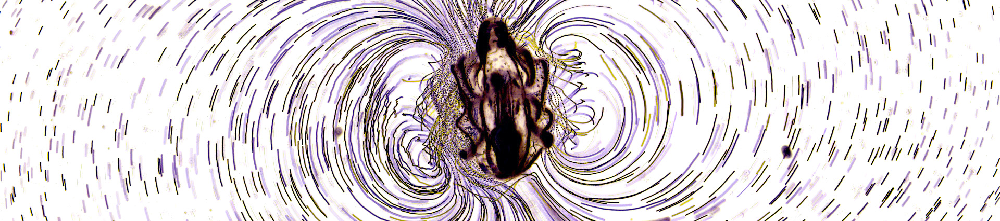

<!-- # The Gilpin Research Group -->
<!-- # Research -->

  

<!-- We are interested in computational nonlinear dynamics, broadly applied.  -->
Our curiosity-driven research group bridges fluid dynamics, statistical learning, and systems biology. We develop new theory and algorithms for analysis and control of chaotic systems---ranging from turbulent puffs to neural spikes---and collaborate to apply these tools broadly. One part of the lab develops novel machine learning algorithms for time series, drawing upon the classical physics of complex systems such as strange attractors, cellular automata, and random graphs. The second part of the group applies these principles to real-world complex systems such as biological measurements and fluid mixing.

Check out our [gallery](pages/gallery.html)

<!-- # Members -->
 
William Gilpin, Assistant Professor of Physics\
Department of Physics & Oden Institute for Computational Engineering and Sciences\
The University of Texas at Austin\
[[CV]](http://www.wgilpin.com/CV/wgilpin_CV.pdf) [[Twitter]](https://twitter.com/wgilpin0) [[Web]](http://www.wgilpin.com/?utm_source=labwebsite) [[Email]](mailto:wgilpin@fas.[dravrah%20spelled%20backwards].edu) [[GitHub]](https://github.com/williamgilpin)

# Join

**Postdocs.** Please email William directly. Please include a CV or resume, and a few sentences explaining which area of the lab's research you are interested in (or if you want to explore a new area). Applicants from diverse or nontraditional academic or personal backgrounds are welcome!

**Graduate Students.** If you have not yet applied, please apply to the Department of Physics or the Oden CSEM program. Other departments are definitely possible, too. If you are already at UT, please email William.

# Alumni 

Yasa Baig. Harvard QBio REU while undergrad at Duke. _Next position:_ Marshall Scholar at Cambridge

<!-- # Publications

_Coming soon once the template is fixed. For now, see William's [CV](http://www.wgilpin.com/CV/wgilpin_CV.pdf)_
 -->

<!-- Global site tag (gtag.js) - Google Analytics -->
<!-- 
 -->

<!-- Global site tag (gtag.js) - Google Analytics -->
<!-- 
 -->

<!-- Note: plugin scripts must be included after the tracking snippet. -->
<!-- 

 -->

<!-- IpMeta must be included after Google Analytics -->
