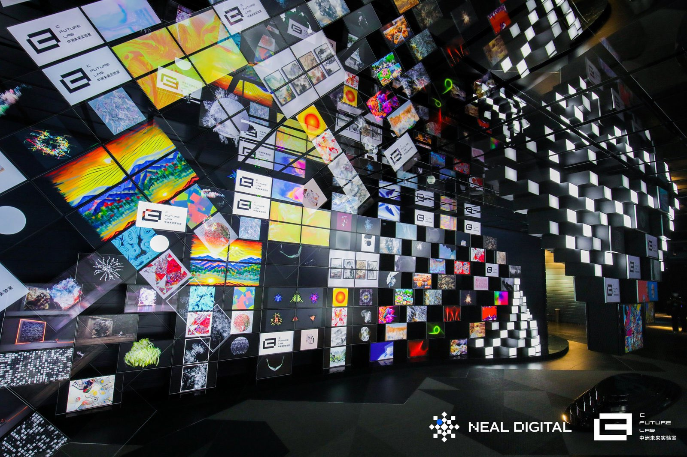

<!-- 
 -->

<!-- <figure>
    <iframe src="https://player.vimeo.com/video/192180842?title=0&byline=0&portrait=0" width="100%" height="400" frameborder="0" webkitallowfullscreen mozallowfullscreen allowfullscreen></iframe> 
    <figcaption>
      Vortex arrays generated by starfish larvae. This video won grand prizes in [the 2016 Nikon Small World in Motion competition](http://www.nikonsmallworld.com/news/article/water-patterns-of-starfish-larva-wins-nikon-swim), [The 2017 NSF "Vizzies" Visualization Challenge](https://www.nsf.gov/news/special_reports/scivis//winners_2017.jsp), and [the American Physical Society's 69th Annual "Gallery of Fluid Motion" competition.](https://gfm.aps.org/meetings/dfd-2016/57d648ebb8ac3117910005f9). See our paper about this phenomenon [here](http://dx.doi.org/10.1038/nphys3981) and visualization technique [here](https://doi.org/10.1101/086140)
    </figcaption>
</figure> -->

<iframe src="https://player.vimeo.com/video/192180842?title=0&byline=0&portrait=0" width="100%" height="400" frameborder="0" webkitallowfullscreen mozallowfullscreen allowfullscreen></iframe> 

Vortex arrays generated by starfish larvae. This video won grand prizes in [the 2016 Nikon Small World in Motion competition](http://www.nikonsmallworld.com/news/article/water-patterns-of-starfish-larva-wins-nikon-swim), [The 2017 NSF "Vizzies" Visualization Challenge](https://www.nsf.gov/news/special_reports/scivis//winners_2017.jsp), and [the American Physical Society's 69th Annual "Gallery of Fluid Motion" competition.](https://gfm.aps.org/meetings/dfd-2016/57d648ebb8ac3117910005f9). See our paper about this phenomenon [here](http://dx.doi.org/10.1038/nphys3981) and visualization technique [here](https://doi.org/10.1101/086140)
  

<iframe src="https://player.vimeo.com/video/641408616?title=0&byline=0&portrait=0" width="100%" height="400" frameborder="0" webkitallowfullscreen mozallowfullscreen allowfullscreen></iframe> 

A montage of 131 discovered strange attractors, the properties of which are described in our recent [paper](https://arxiv.org/abs/2110.05266) and [database](https://github.com/williamgilpin/dysts).

<iframe src="https://player.vimeo.com/video/641408092?title=0&byline=0&portrait=0" width="100%" height="400" frameborder="0" webkitallowfullscreen mozallowfullscreen allowfullscreen></iframe> 

The Hadley model for atmospheric convection. This system is included in our recent [paper](https://arxiv.org/abs/2110.05266) presenting a [database](https://github.com/williamgilpin/dysts) of strange attractors for benchmarking time series forecasting models

<iframe src="https://player.vimeo.com/video/641413199?title=0&byline=0&portrait=0" width="100%" height="400" frameborder="0" webkitallowfullscreen mozallowfullscreen allowfullscreen></iframe> 

Six stages of training a convolutional neural network on Conway's Game of Life cellular automaton. See recent [paper](https://journals.aps.org/pre/abstract/10.1103/PhysRevE.100.032402) and its accompanying [code](https://github.com/williamgilpin/convoca)

<iframe src="https://player.vimeo.com/video/144166179?title=0&byline=0&portrait=0" width="100%" height="400" frameborder="0" webkitallowfullscreen mozallowfullscreen allowfullscreen></iframe> 

The feeding current of *Stentor sp.*, collected from a pond and processed using flowtrace. The current captures many large particles, but smaller swimming algae and protozoans are able to escape. Video shown at 8x true speed. Our visualization technique is described in our [paper](https://doi.org/10.1101/086140), and the code is available [here](http://flowtrace.org/)

<iframe src="https://player.vimeo.com/video/641410665?title=0&byline=0&portrait=0" width="100%" height="400" frameborder="0" webkitallowfullscreen mozallowfullscreen allowfullscreen></iframe> 

Training four different forecasting models on the chaotic attractor of the Lorenz system. From the benchmarks of our recent [paper](https://arxiv.org/abs/2110.05266) and [database](https://github.com/williamgilpin/dysts) for benchmarking time series forecasting models on chaotic attractors.

<iframe src="https://player.vimeo.com/video/641414845?title=0&byline=0&portrait=0" width="100%" height="400" frameborder="0" webkitallowfullscreen mozallowfullscreen allowfullscreen></iframe> 

 Embedding an EEG dataset using techniques for reconstructing the attractors of dynamical systems. See recent [paper](https://arxiv.org/abs/2002.05909) and its accompanying [code](https://github.com/williamgilpin/fnn)

<!-- 1600 x 1067 -->

<!--  -->
 
Two of the videos shown above were included in the 2021--2022 Neal Gallery traveling exhibition in Shenzhen and Hangzhou.

<!--  -->

A feeding tornaria, the larva of an acorn worm.

<!--  -->

Hexagonal cells in a two-dimensional foam.

<iframe src="https://player.vimeo.com/video/641414619?title=0&byline=0&portrait=0" width="100%" height="400" frameborder="0" webkitallowfullscreen mozallowfullscreen allowfullscreen></iframe> 

Trajectories of the FitzHugh-Nagumo neuron model in a limit cycle regime. Dynamical noise is included, and purple dashes indicate the nullcline of a slow variable.

<iframe src="https://player.vimeo.com/video/263223043?title=0&byline=0&portrait=0" width="100%" height="400" frameborder="0" webkitallowfullscreen mozallowfullscreen allowfullscreen></iframe> 

Particles advected by the blinking vortex map. This controllable chaotic fluid flow was used in our paper on cryptography with hydrodynamics [here](https://www.pnas.org/content/115/19/4869)

<iframe src="https://player.vimeo.com/video/641409391?title=0&byline=0&portrait=0" width="100%" height="400" frameborder="0" webkitallowfullscreen mozallowfullscreen allowfullscreen></iframe> 

Thomas' cyclic chaotic attractor. This system is included in our recent [paper](https://arxiv.org/abs/2110.05266) presenting a [database](https://github.com/williamgilpin/dysts) of strange attractors for benchmarking time series forecasting models

<!-- <iframe src="https://player.vimeo.com/video/641414619" width="640" height="564" frameborder="0" allow="autoplay; fullscreen" allowfullscreen></iframe>
 -->

