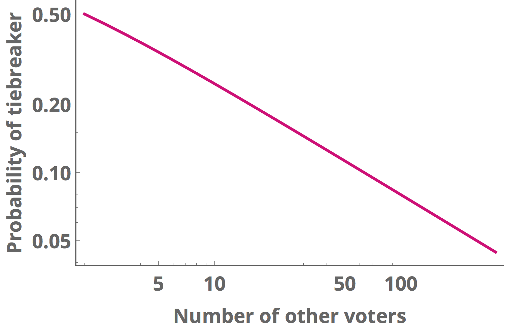

Solution to the 538 Riddler, [posted on 11.5.2016](http://fivethirtyeight.com/features/a-puzzle-will-you-yes-you-decide-the-election/)

<i>
You are the only sane voter in a state with two candidates running for Senate. There are N other people in the state, and each of them votes completely randomly! Those voters all act independently and have a 50-50 chance of voting for either candidate. What are the odds that your vote changes the outcome of the election toward your preferred candidate?
</i>

#### Brief solution:

The probability decreases with N according to a binomial distribution, which can be interpreted as describing the odds of getting N/2 heads in a set of N coin tosses. For large N, you can use Stirling's approximation to simplify the factorial. This results in the prediction that, as the population size doubles, your probability of deciding the election decreases by a factor of sqrt(2) = 1.414

#### Full Solution

Because each other citizen's vote is essentially a coin toss (a Bernoulli random variable), the probability of recieving k heads in N fair coin tosses is given by the binomial distribution

where N is the number of coin tosses, k is the number of heads, and $p$ is the probability of recieving heads (p=0.5 for a fair coin).

We assume that, for the Senate election, if there is an even number of voters total (N-1 is an odd number), then the election is decided by yet anohter coin toss. This is equivalent to adding an extra uninformed voter to the pool of citizenry, resulting in an odd overall number of voters including you.

In this case, the probability that you are the deciding vote is equivalent to finding the probability that the pool of N voters is evenly split between the two candidates. This is equivalent to flipping a coin N times and recieving N/2 heads. Plugging into the binomial theorem,

For sufficiently large populations we can approximate the factorial functions using Stirling's approximation,

Plugging this in for N and N/2 yeilds a simple expression for the probability of deciding as a function of $N$

This distribution predicts that, as the size of the total population doubles, the probability that your vote decides the election will decrease by a factor of about sqrt(2) = 1.414

Finally, here is the probability of your vote deciding the election, plotted as function of the population size using logarithmic axes

